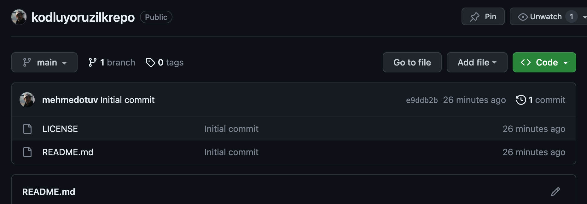

# GitHub' ta Repo İşlemleri

Bu repo [Kodluyoruz](https://academy.patika.dev/courses/git)' da GIT eğitiminde oluşturulan il repodur.inde bir adet README.md dosyası, bir adet de index.html barındırıyor.

# Kurulum

Öncelikle projeyi clonelayın.

git clone https://github.com/mehmedotuv/kodluyoruzilkrepo.git

# Kullanım

Projeyi cloneladıktan sonra Linux' da terminal uygulamasını açın ve aşağıdaki kodu yazın.

cd kodluyoruzilkrepo
code .

# KATKI

Pull requestler kabul edilir. Büyük değişiklikler için, lütfen önce neyi değiştirmek istediğinizi tartışmak için bir konu açınız.

# Lisans

Bu proje [MIT] altında lisanslanmıştır.
